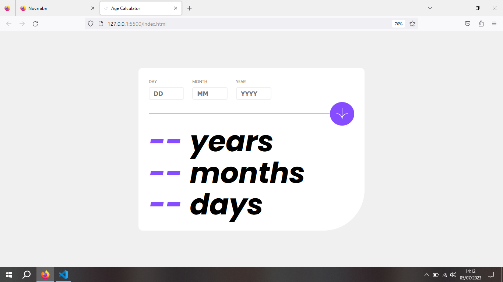

<h1>Calculadora de  Idade!</h1>
 

Mais um desafio do Frontend Mentor. O html e CSS fiz praticamente sem seguir nenhum tutorial. Porém o JavaScript eu acompanhei um tutorial do Youtube.

 

 

Senti dificuldade no Javascript, mas já coonsegui entender muito melhor o código. Estou procurando ler muitos códigos pra ir me adaptando com outros devs.

